<div align="center">

# SQHell - TryHackMe Writeup


**Platform:** TryHackMe  
**Room:** [SQHell](https://tryhackme.com/room/sqhell)  
**Difficulty:** Medium  

</div align="center">

---

## Overview

The SQHell room is a focused SQL injection challenge designed to sharpen your understanding of multiple SQLi techniques. Once the target machine boots, you're tasked with uncovering five hidden flags by exploiting different types of SQL injection vulnerabilities across the application.

This write-up documents my approach to each flag, emphasizing not just the payloads used but the reasoning behind each step - understanding how each injection works, why it succeeds, and how to adapt techniques across different SQLi contexts.

---

## Enumeration

Initial port scanning revealed that ports **22** and **80** are open. Since a web server was running, I navigated to the page.

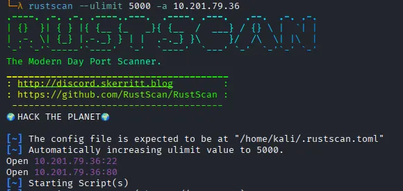

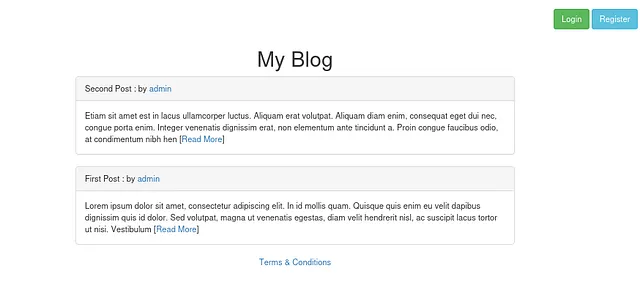

---

## Flag 1 - Authentication Bypass

The homepage presented a **Login** page, which is always a good starting point for SQL injection testing.

On the login form, a basic SQLi authentication bypass payload worked immediately. This indicated the backend query was something along the lines of:

```sql
SELECT * FROM users WHERE username = '' OR 1=1 -- ' AND password = '...'
```

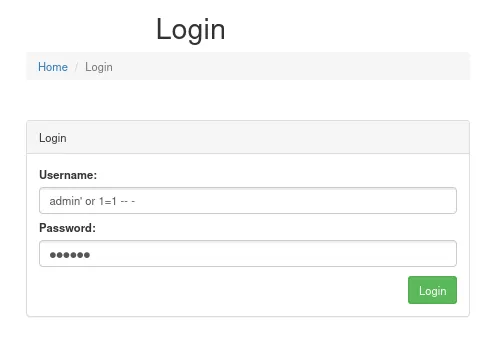
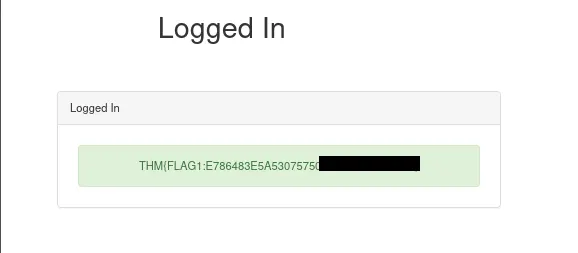

---

## Flag 2 - Header-Based (Second-Order) SQL Injection

The hint pointed me to the **Terms and Conditions** page, which contained a notable clause:

> *"We log your IP address for analytics purposes."*

This immediately suggested the application was capturing the IP address from a request header - likely `X-Forwarded-For` - and inserting it into a backend SQL query. If the value was pulled directly without sanitization, it would be a viable injection point, especially for **second-order SQLi**, where the payload is stored first and executed later.

I used `sqlmap` to test the header:

```bash
sqlmap -u "http://<TARGET>/index.php" --headers="X-Forwarded-For: *" --dbs
```
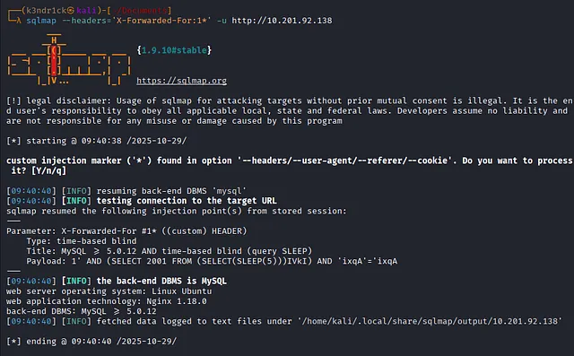

`sqlmap` confirmed the header was vulnerable to **time-based blind injection**. Enumerating the database revealed `sqhell_1` with a `flag` table containing the second flag.

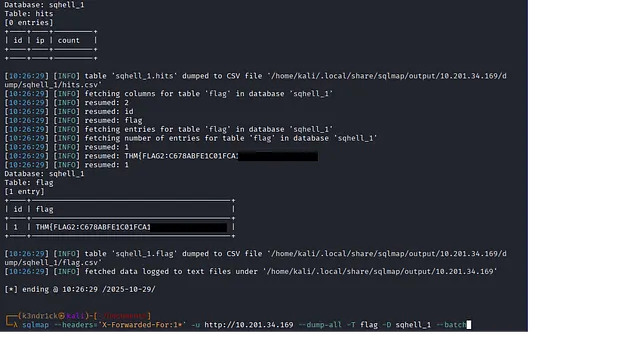

---

## Flag 3 - UNION-Based Injection via URL Parameter

Exploring the homepage further, I noticed a **Read More** link redirecting to a post page with a URL like:

```
http://<TARGET>/post.php?id=1
```

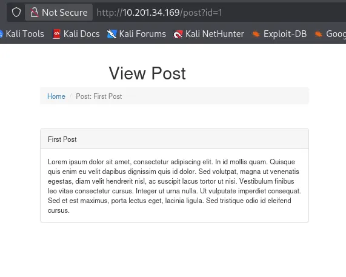

To test for SQLi, I appended a single quote to the `id` value:

```
http://<TARGET>/post.php?id=1'
```

This triggered a SQL syntax error, confirming the parameter was injectable. I then tested for column count and found the page rendered content from the **second and third columns**.

```sql
1 UNION SELECT 1,2,3-- -
```

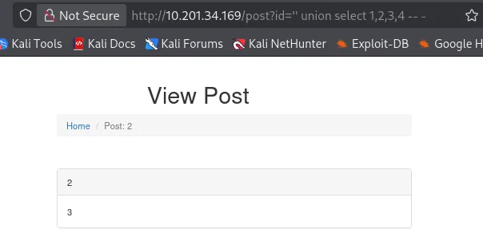

After enumerating the database with UNION-based injection, I found a `flag` table containing the third flag.

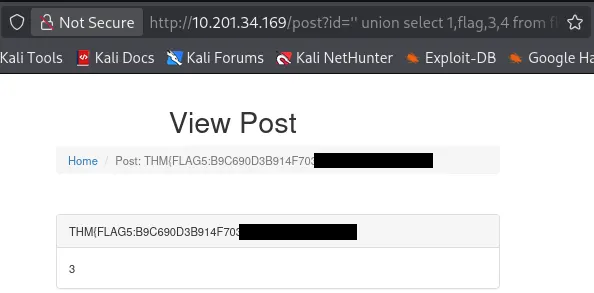

---

## Flag 4 - Nested UNION Injection (Inception)

The hint for this flag was:

> *"Well, dreams, they feel real while we're in them, right?"*

A direct reference to **Inception**, the movie hinting at something layered: a query within a query.

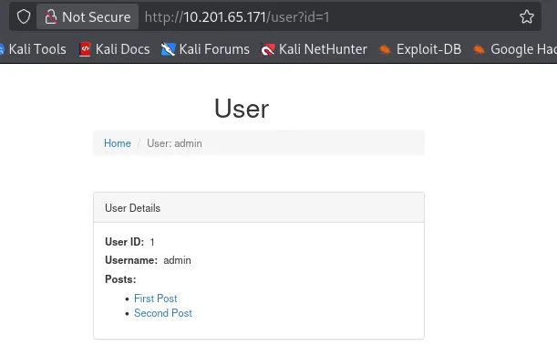

I had already confirmed the endpoint was vulnerable to `UNION SELECT`. While testing, I noticed the **first column** in the injected result controlled whether posts were rendered. With a value of `2` in the first column, no post appeared - meaning the first column's value was being used as a query parameter internally.

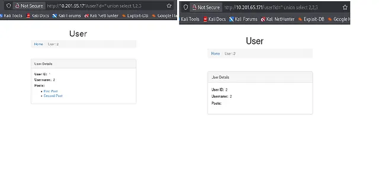

This meant I could inject a second `UNION SELECT` statement **inside the first column's string**:

```sql
' UNION SELECT "2 UNION SELECT 1,2,3,4",2,3-- -
```
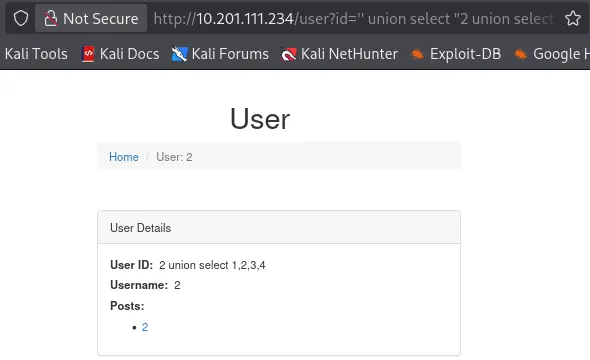


After identifying that the **second column of the inner query** was displayed in the posts section, I enumerated the database through the nested injection and retrieved the fourth flag.

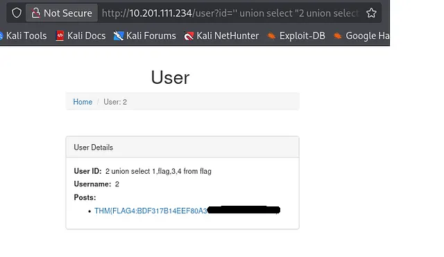

---

## Flag 5 - Boolean-Based Blind Injection (Registration)

On the **registration page**, the application checked username availability in real time. The likely backend query:

```sql
SELECT * FROM users WHERE username = '<input>'
```

I tested the username field with a boolean payload:

```sql
' OR 1=1-- -
```

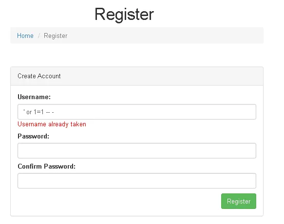

The application responded with *"Username already taken"* even though the username didn't exist - confirming SQL injection via a **boolean-based blind** vulnerability.

Since manual exploitation of blind SQLi is time-consuming, I used `sqlmap`. I first captured the GET request in **Burp Suite** and saved it to `usercheck.txt`:

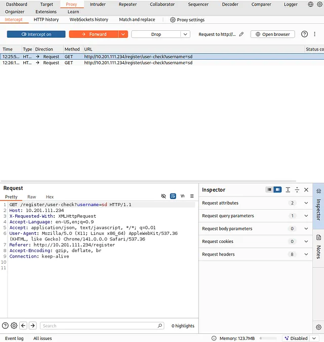

```bash
sqlmap -r usercheck.txt --dbs
sqlmap -r usercheck.txt -D sqhell_1 --tables
sqlmap -r usercheck.txt -D sqhell_1 -T flag --dump
```
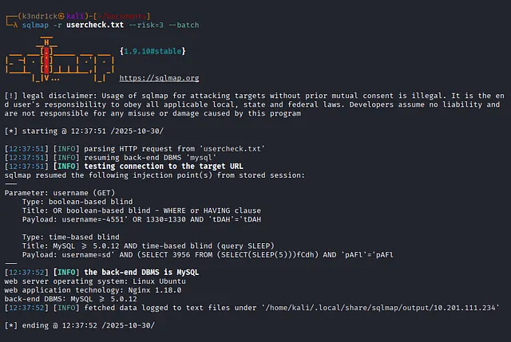

`sqlmap` confirmed the vulnerability and, after enumeration, returned the fifth and final flag.

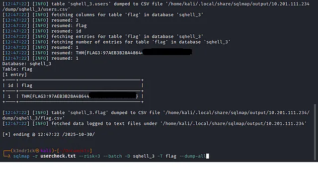

---

## Summary

| Flag | Injection Type | Entry Point |
|------|---------------|-------------|
| 1 | Authentication Bypass | Login form |
| 2 | Second-Order / Header Injection | `X-Forwarded-For` header |
| 3 | UNION-Based | `id` URL parameter |
| 4 | Nested UNION (Inception) | First column as subquery |
| 5 | Boolean-Based Blind | Username availability check |

---

## Lessons Learned

SQHell was a solid challenge that pushed me to think beyond basic payloads. Each flag required careful reasoning, not just exploitation. Key takeaways:

- **Always check HTTP headers** as injection points - not just form fields and URL parameters.
- **Observe application behavior** closely; subtle differences (post rendering, error messages, response timing) reveal the injection type.
- **Nested queries** are possible when application logic uses user-controlled data as a secondary query input.
- **Boolean-based blind SQLi** is best handled with `sqlmap` and Burp Suite request capture for efficiency.
